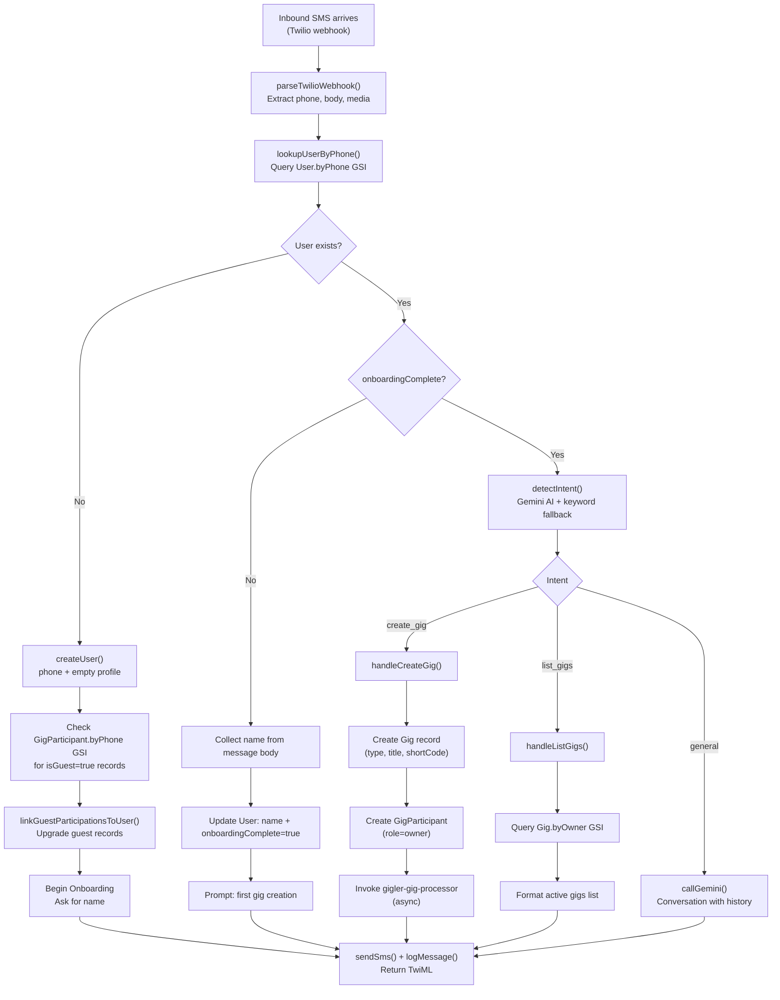
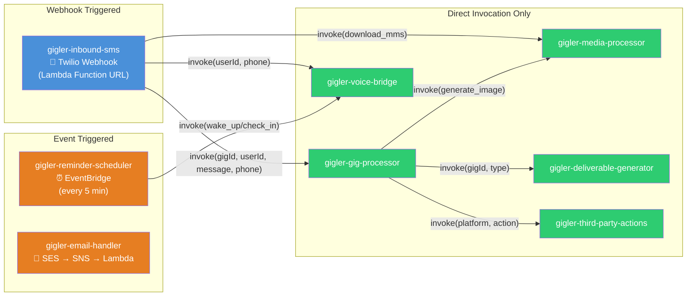
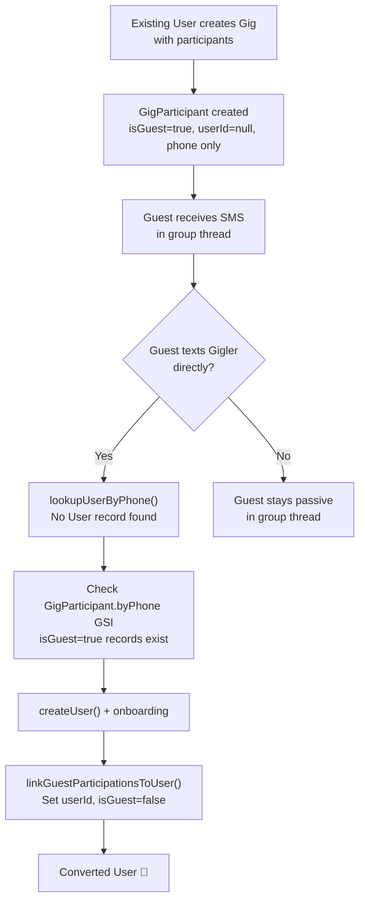
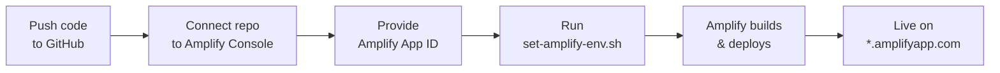

# Gigler — Architecture Documentation

> **Gigler** is an AI assistant that lives in text messages. Users create "Gigs" (projects/tasks) by texting. This document serves as the comprehensive developer onboarding reference for the platform.

---

## Table of Contents

- [Tech Stack](#tech-stack)
- [High-Level Architecture](#high-level-architecture)
- [Inbound SMS Routing Flow](#inbound-sms-routing-flow)
- [Lambda Invocation Patterns](#lambda-invocation-patterns)
- [DynamoDB Data Model](#dynamodb-data-model)
- [Lambda Functions](#lambda-functions)
- [Backend Wiring](#backend-wiring)
- [Next.js Frontend Routes](#nextjs-frontend-routes)
- [Shared Libraries](#shared-libraries)
- [Authentication](#authentication)
- [Viral Growth Loop](#viral-growth-loop)
- [Pricing Tiers](#pricing-tiers)
- [Safety & Tooling](#safety--tooling)
- [Deployment Workflow](#deployment-workflow)

---

## Tech Stack

| Layer | Technology | Role |
|---|---|---|
| **Infrastructure** | AWS Amplify Gen 2 | Backend infra, DynamoDB, Lambda, Cognito auth, S3 storage |
| **Frontend** | Next.js 16 (App Router) | SSR/SSG, Tailwind CSS |
| **Messaging** | Twilio (Conversations API) | SMS/MMS group threads, voice calls |
| **AI Engine** | Google Gemini | Conversation, intent detection, gig execution, image generation |
| **Voice** | Pipecat + Gemini Live | Real-time voice bridge for calls |
| **Image/Video** | Gemini Imagen, OpenAI DALL-E / Sora | AI image generation (primary + fallback), video generation |
| **Email** | AWS SES | Inbound + outbound email processing |
| **Scheduling** | AWS EventBridge | Scheduled reminders (every 5 min) |
| **CDN** | AWS CloudFront | Deliverable URL distribution |
| **Billing** | Stripe | Subscriptions, billing portal |
| **Third-Party** | OpenTable, Resy, Evite | Adapter pattern for reservations/invites |

---

## High-Level Architecture

```mermaid
graph TB
    subgraph Input Channels
        SMS["📱 SMS/MMS<br/>(Twilio)"]
        VOICE["📞 Voice<br/>(Pipecat + Gemini Live)"]
        EMAIL["📧 Email<br/>(AWS SES)"]
        WEB["🌐 Web Dashboard<br/>(Next.js)"]
    end

    subgraph Lambda Functions
        L1["gigler-inbound-sms<br/><i>Main Brain</i>"]
        L2["gigler-gig-processor<br/><i>AI Execution Engine</i>"]
        L3["gigler-reminder-scheduler<br/><i>Cron: every 5 min</i>"]
        L4["gigler-media-processor<br/><i>MMS/Image/Video</i>"]
        L5["gigler-deliverable-generator<br/><i>PDF/Website/Code</i>"]
        L6["gigler-voice-bridge<br/><i>Pipecat + Gemini Live</i>"]
        L7["gigler-email-handler<br/><i>SES Inbound</i>"]
        L8["gigler-third-party-actions<br/><i>OpenTable/Resy/Evite</i>"]
    end

    subgraph Data Layer
        DYNAMO["DynamoDB<br/>(10 tables)"]
        S3["S3 Bucket<br/>(media + deliverables)"]
        CF["CloudFront CDN<br/>(public URLs)"]
    end

    subgraph AI Layer
        GEMINI["Google Gemini<br/>(conversation + intent)"]
        IMAGEN["Gemini Imagen<br/>(image gen)"]
        DALLE["OpenAI DALL-E<br/>(image fallback)"]
        SORA["OpenAI Sora<br/>(video gen)"]
    end

    subgraph External Services
        TWILIO_SVC["Twilio API"]
        STRIPE_SVC["Stripe"]
        OPENTABLE["OpenTable"]
        RESY["Resy"]
        EVITE["Evite"]
    end

    subgraph Triggers
        EB["EventBridge<br/>(5-min schedule)"]
        SNS["SNS<br/>(SES notifications)"]
    end

    subgraph Next.js Pages
        LANDING["/ Landing"]
        EXAMPLES["/examples"]
        PRICING["/pricing"]
        SHORTCODE["/[shortCode]"]
        DASH["/dashboard"]
        GIGDETAIL["/dashboard/[gigId]"]
        SETTINGS["/dashboard/settings"]
    end

    SMS -->|Webhook| L1
    VOICE -->|Invoke| L6
    EMAIL -->|SES → SNS| L7
    WEB --> LANDING & EXAMPLES & PRICING & SHORTCODE & DASH & GIGDETAIL & SETTINGS

    EB -->|Schedule| L3

    L1 -->|Direct invoke| L2
    L1 -->|Direct invoke| L4
    L2 -->|Direct invoke| L4
    L2 -->|Direct invoke| L5
    L2 -->|Direct invoke| L8
    L3 -->|Direct invoke| L6
    L1 -->|Direct invoke| L6
    SNS -->|Trigger| L7

    L1 & L2 & L3 & L7 --> DYNAMO
    L4 & L5 & L7 --> S3
    S3 --> CF

    L1 & L2 --> GEMINI
    L4 --> IMAGEN
    L4 -.->|fallback| DALLE
    L4 -.->|placeholder| SORA
    L7 --> GEMINI

    L1 & L2 & L3 & L6 --> TWILIO_SVC
    L8 --> OPENTABLE & RESY & EVITE

    DASH & GIGDETAIL & SETTINGS -->|Cognito Auth| DYNAMO
    SHORTCODE --> DYNAMO

    SETTINGS --> STRIPE_SVC
```



---

## Inbound SMS Routing Flow

This is the core logic inside `gigler-inbound-sms` — the "Main Brain" of the platform.



---

## Lambda Invocation Patterns



**Legend:**
- 🔵 Blue = Webhook-triggered (external HTTP)
- 🟠 Orange = Event-triggered (EventBridge / SES → SNS)
- 🟢 Green = Direct invocation only (called by other Lambdas)

---

## DynamoDB Data Model

> **Zero ScanCommand in production.** Every access pattern uses a GSI or primary key.

### Table Overview

| # | Table | Primary Key | GSIs | Purpose |
|---|---|---|---|---|
| 1 | User | `id` (PK) | `byPhone`, `byEmail` | User profiles and billing |
| 2 | Gig | `id` (PK) | `byOwner`, `byShortCode`, `byConversationSid` | Projects/tasks |
| 3 | GigParticipant | `gigId` (PK) + `phone` (SK) | `byUserId`, `byPhone` | Gig membership and roles |
| 4 | Message | `gigId` (PK) + `timestamp` (SK) | `bySender` | Conversation history |
| 5 | Media | `gigId` (PK) + `mediaId` (SK) | — | Photos, videos, documents |
| 6 | Deliverable | `gigId` (PK) + `deliverableId` (SK) | `byShortCode` | Generated outputs (PDF, website, etc.) |
| 7 | Reminder | `id` (PK) | `byGig`, `byScheduledAt` | Scheduled notifications |
| 8 | ThirdPartyAction | `id` (PK) | `byGig`, `byStatus` | External platform actions |
| 9 | UserIntegration | `id` (PK) | `byUserId` | OAuth tokens for third-party services |
| 10 | *(All defined in `amplify/data/resource.ts`)* | | | |

### Detailed Table Schemas

#### 1. User

| Field | Type | Description |
|---|---|---|
| `id` | String (PK) | Unique user identifier |
| `phone` | String | Phone number (GSI: `byPhone`) |
| `email` | String | Email address (GSI: `byEmail`) |
| `name` | String | Display name |
| `plan` | Enum | `free` / `pro` / `team` / `enterprise` |
| `onboardingComplete` | Boolean | Whether name collection is done |
| `preferences` | JSON | User preferences |
| `timezone` | String | IANA timezone |
| `stripeCustomerId` | String | Stripe customer reference |

#### 2. Gig

| Field | Type | Description |
|---|---|---|
| `id` | String (PK) | Unique gig identifier |
| `ownerId` | String | User who created the gig (GSI: `byOwner`) |
| `title` | String | Gig title |
| `description` | String | Gig description |
| `type` | Enum | One of 9 types (see below) |
| `status` | Enum | `active` / `paused` / `completed` / `archived` |
| `conversationSid` | String | Twilio Conversation SID (GSI: `byConversationSid`) |
| `twilioNumber` | String | Assigned Twilio number |
| `shortCode` | String | 6-char alphanumeric code (GSI: `byShortCode`) |
| `metadata` | JSON | Type-specific state (checklists, URLs, dates) |
| `completedAt` | String | ISO timestamp |

**9 Gig Types:**

| Type | Description |
|---|---|
| `coding` | Code generation, scaffolding, deployment |
| `planning` | Checklists, participants, reminders |
| `creative` | Image generation, design work |
| `professional` | Document drafting (resumes, letters) |
| `lifestyle` | Personal errands and lifestyle management |
| `scheduling` | Calendar, reminders, time management |
| `education` | Study plans, tutoring, learning paths |
| `business_formation` | Step-by-step LLC/business guidance |
| `reservations` | Restaurant booking via OpenTable/Resy |

#### 3. GigParticipant

| Field | Type | Description |
|---|---|---|
| `gigId` | String (PK) | Gig reference |
| `phone` | String (SK) | Phone number (also GSI: `byPhone`) |
| `userId` | String | User reference, null for guests (GSI: `byUserId`) |
| `role` | Enum | `owner` / `collaborator` / `viewer` |
| `name` | String | Display name |
| `isGuest` | Boolean | True for non-registered participants |
| `joinedAt` | String | ISO timestamp |
| `invitedBy` | String | userId of inviter |

> The `byPhone` GSI is critical for finding guest participants who have no `userId`. On user conversion, `linkGuestParticipationsToUser()` upgrades these records.

#### 4. Message

| Field | Type | Description |
|---|---|---|
| `gigId` | String (PK) | Gig reference |
| `timestamp` | String (SK) | ISO timestamp (enables range queries) |
| `senderId` | String | Sender reference (GSI: `bySender`, sort: `timestamp`) |
| `senderName` | String | Display name |
| `body` | String | Message text |
| `mediaUrls` | List[String] | Attached media URLs |
| `messageType` | Enum | `sms` / `mms` / `voice_note` / `system` / `ai` |
| `direction` | Enum | `inbound` / `outbound` |

> Composite key (`gigId` + `timestamp`) supports efficient newest-first range queries for conversation history retrieval.

#### 5. Media

| Field | Type | Description |
|---|---|---|
| `gigId` | String (PK) | Gig reference |
| `mediaId` | String (SK) | Unique media identifier |
| `s3Key` | String | S3 object key |
| `type` | Enum | `photo` / `video` / `document` / `code` / `pdf` / `voice_note` |
| `uploadedBy` | String | User reference |
| `caption` | String | Optional description |

#### 6. Deliverable

| Field | Type | Description |
|---|---|---|
| `gigId` | String (PK) | Gig reference |
| `deliverableId` | String (SK) | Unique deliverable identifier |
| `type` | Enum | `pdf` / `website` / `menu` / `collage` / `code_project` |
| `title` | String | Deliverable title |
| `s3Key` | String | S3 object key |
| `publicUrl` | String | CloudFront URL |
| `shortCode` | String | 6-char code (GSI: `byShortCode`) |
| `expiresAt` | String | ISO timestamp |

> **Short URL system**: 6-char alphanumeric codes, collision-checked. Reserved paths excluded: `dashboard`, `settings`, `pricing`, `login`, `signup`, `api`, `examples`, `d`, `admin`, `billing`, `help`, `support`.

#### 7. Reminder

| Field | Type | Description |
|---|---|---|
| `id` | String (PK) | Unique reminder identifier |
| `gigId` | String | Gig reference (GSI: `byGig`, sort: `scheduledAt`) |
| `userId` | String | User reference |
| `scheduledAt` | String | ISO timestamp (GSI: `byScheduledAt`) |
| `type` | Enum | `reminder` / `wake_up_call` / `check_in` / `countdown` |
| `message` | String | Reminder text |
| `channel` | Enum | `sms` / `voice` |
| `recipients` | List[String] | Phone numbers |
| `sent` | Boolean | Whether reminder has been dispatched |

#### 8. ThirdPartyAction

| Field | Type | Description |
|---|---|---|
| `id` | String (PK) | Unique action identifier |
| `gigId` | String | Gig reference (GSI: `byGig`) |
| `userId` | String | User reference |
| `platform` | String | `opentable` / `resy` / `evite` |
| `actionType` | String | Platform-specific action |
| `status` | Enum | `pending` / `confirmed` / `cancelled` / `failed` (GSI: `byStatus`) |
| `requestPayload` | JSON | Outbound request data |
| `responsePayload` | JSON | Platform response data |
| `externalId` | String | Platform's booking/event ID |
| `confirmedAt` | String | ISO timestamp |

> **Confirmation loop**: ALWAYS confirms with user via SMS before finalizing any booking.

#### 9. UserIntegration

| Field | Type | Description |
|---|---|---|
| `id` | String (PK) | Unique integration identifier |
| `userId` | String | User reference (GSI: `byUserId`) |
| `platform` | String | Service name |
| `oauthToken` | String | Access token |
| `refreshToken` | String | Refresh token |
| `expiresAt` | String | Token expiry |
| `scopes` | List[String] | Granted OAuth scopes |

---

## Lambda Functions

All Lambda functions are defined in `amplify/functions/` with a consistent structure:
- `resource.ts` — `defineFunction()` configuration (timeout, memory, env vars)
- `handler.ts` — Implementation

### 1. gigler-inbound-sms — Main Brain

| Property | Value |
|---|---|
| **Trigger** | Twilio webhook (Lambda Function URL) |
| **Timeout** | 60s |
| **Memory** | 512MB |
| **Env vars** | `TWILIO_ACCOUNT_SID`, `TWILIO_AUTH_TOKEN`, `GIGLER_NUMBER`, `GEMINI_API_KEY`, `GEMINI_MODEL` |
| **Tables** | User (RW), Gig (RW), Message (RW), GigParticipant (RW) |

**Processing pipeline:**

1. `parseTwilioWebhook()` — Extract phone, body, NumMedia, MediaUrls from URL-encoded body
2. `lookupUserByPhone()` — Query `User.byPhone` GSI
3. Route based on user state:
   - **New user** → `createUser()` → check `GigParticipant.byPhone` for guest records → `linkGuestParticipationsToUser()` → onboarding state machine (collect name → mark complete)
   - **Onboarding incomplete** → collect name from message → update user → prompt first gig
   - **Onboarded user** → `detectIntent()` via Gemini (+ fallback keyword classifier) → route to handler
4. Intent handlers: `handleCreateGig()`, `handleListGigs()`, `callGemini()` (general conversation)
5. `sendSms()` + `logMessage()` → return `twimlResponse()`

### 2. gigler-gig-processor — AI Execution Engine

| Property | Value |
|---|---|
| **Trigger** | Direct Lambda invocation from `inbound-sms` |
| **Timeout** | 120s |
| **Memory** | 512MB |
| **Env vars** | `GEMINI_API_KEY`, `GEMINI_MODEL`, `TWILIO_*`, `GIGLER_NUMBER` |
| **Tables** | Gig (RW), Message (RW), Deliverable (RW), Reminder (RW) |

**Processing pipeline:**

1. Receive `{gigId, userId, message, phone}`
2. Fetch gig metadata from Gig table
3. Fetch conversation history (composite key query, newest-first)
4. Build type-specific Gemini system prompt (9 prompts, one per gig type)
5. Execute AI response → parse for actions (create deliverable, set reminder, book reservation)
6. `logMessage()` + `sendSms()`

**Type-specific prompt behaviors:**

| Gig Type | AI Behavior |
|---|---|
| `planning` | Manages checklists, participants, reminders |
| `coding` | Generates code, creates scaffolds, triggers deployment |
| `creative` | Triggers image generation via `media-processor` |
| `professional` | Drafts documents (resumes, cover letters, proposals) |
| `scheduling` | Sets reminders, manages calendar events |
| `education` | Creates study plans, quizzes, learning paths |
| `business_formation` | Step-by-step LLC guidance with document generation |
| `reservations` | Searches/books via third-party adapters with confirmation loop |
| `lifestyle` | General lifestyle task management |

### 3. gigler-reminder-scheduler

| Property | Value |
|---|---|
| **Trigger** | EventBridge schedule (every 5 minutes) |
| **Timeout** | 60s |
| **Memory** | 256MB |
| **Tables** | Reminder (RW), User (RO), Gig (RO) |

**Processing pipeline:**

1. Query `Reminder.byScheduledAt` GSI for `scheduledAt <= now AND sent = false`
2. For each due reminder:
   - `sms` channel → `sendSms()` to all recipients
   - `voice` channel → invoke `gigler-voice-bridge`
3. Mark reminder as `sent = true`

### 4. gigler-media-processor

| Property | Value |
|---|---|
| **Trigger** | Direct Lambda invocation |
| **Timeout** | 120s |
| **Memory** | 1024MB |
| **Env vars** | `TWILIO_*`, `GEMINI_API_KEY`, `OPENAI_API_KEY` |
| **Tables** | Media (RW), S3 bucket (RW) |

**Three action types:**

| Action | Pipeline |
|---|---|
| `download_mms` | Download from Twilio URL (authenticated) → detect content type → upload to S3 → create Media record |
| `generate_image` | Call Gemini Imagen (primary) or DALL-E (fallback) → store in S3 → create Media record |
| `generate_video` | Placeholder for OpenAI Sora integration |

### 5. gigler-deliverable-generator

| Property | Value |
|---|---|
| **Trigger** | Direct Lambda invocation from `gig-processor` |
| **Timeout** | 120s |
| **Memory** | 1024MB |
| **Tables** | Deliverable (RW), Gig (RO), S3 bucket (RW) |

**Processing pipeline:**

1. Generate `shortCode` (6-char alphanumeric, collision-checked, reserved paths excluded)
2. Create content by deliverable type:

| Type | Generation Method |
|---|---|
| `pdf` | Raw PDF generation (pdf-lib ready) |
| `website` | HTML page generation → S3 upload |
| `menu` | HTML menu page → S3 upload |
| `collage` | Photo aggregation page |
| `code_project` | README/scaffold page |

3. Create Deliverable record with `publicUrl` (CloudFront) and `shortCode`

### 6. gigler-voice-bridge

| Property | Value |
|---|---|
| **Trigger** | Direct Lambda invocation from `reminder-scheduler` or `inbound-sms` |
| **Timeout** | 300s |
| **Memory** | 512MB |
| **Tables** | Gig (RO), User (RO) |

**Call types:**

| Type | Purpose |
|---|---|
| `wake_up` | Daily briefing of active gigs |
| `check_in` | Gig progress update call |
| `consultation` | On-demand voice conversation |

**Pipeline:** Receive `{type, userId, gigId, phone}` → fetch user + active gigs → build briefing → initiate Twilio call with Pipecat + Gemini Live for real-time voice.

> **Fallback**: SMS delivery while Pipecat deployment is pending.

### 7. gigler-email-handler

| Property | Value |
|---|---|
| **Trigger** | SES Receipt Rules → SNS → Lambda |
| **Timeout** | 60s |
| **Memory** | 512MB |
| **Tables** | Gig (RW), User (RO), Message (RW), Media (RW), S3 (RW) |

**Routing by recipient address:**

| Address Pattern | Resolution |
|---|---|
| `gig@gigler.ai` | Match sender email → `User.byEmail` GSI → find active gig |
| `[shortCode]@gigler.ai` | Match shortCode → `Gig.byShortCode` GSI |

**Pipeline:**

1. Parse SES notification (headers, body, attachments)
2. Route to correct gig
3. **AI extraction** via Gemini: dates, addresses, confirmation numbers from email body
4. Store attachments in S3, link as Media records
5. SMS notification to gig owner summarizing the email

### 8. gigler-third-party-actions

| Property | Value |
|---|---|
| **Trigger** | Direct Lambda invocation from `gig-processor` |
| **Timeout** | 60s |
| **Memory** | 256MB |
| **Tables** | ThirdPartyAction (RW), Gig (RO), UserIntegration (RO) |

**Adapter pattern** — each platform implements a standard interface:

```
search(criteria)  → results[]
execute(action)   → ThirdPartyAction (status: pending)
confirm(actionId) → ThirdPartyAction (status: confirmed)
cancel(actionId)  → ThirdPartyAction (status: cancelled)
```

**Available adapters:**

| Adapter | Platform | Status |
|---|---|---|
| `OpenTableAdapter` | OpenTable | Active |
| `ResyAdapter` | Resy | Active |
| `EviteAdapter` | Evite | Active |
| *(extensible)* | DoorDash, Instacart, Uber, Yelp | Planned |

**Status flow:** `pending` → `confirmed` / `cancelled` / `failed`

> Request and response payloads are stored for audit and debugging.

---

## Backend Wiring

Defined in `amplify/backend.ts`:

```
defineBackend({
  // All 8 Lambda functions registered
  giglerInboundSms,
  giglerGigProcessor,
  giglerReminderScheduler,
  giglerMediaProcessor,
  giglerDeliverableGenerator,
  giglerVoiceBridge,
  giglerEmailHandler,
  giglerThirdPartyActions,
})
```

### Permission Grants

The `grantTableAccess()` helper grants read/write + GSI query permissions and passes the table name as an environment variable.

| Lambda | DynamoDB Tables | S3 | SES | Notes |
|---|---|---|---|---|
| `inbound-sms` | User, Gig, Message, GigParticipant (RW) | — | Send | Main brain |
| `gig-processor` | Gig, Message, Deliverable, Reminder (RW) | — | — | AI engine |
| `reminder-scheduler` | Reminder (RW), User (RO), Gig (RO) | — | Send | Cron job |
| `media-processor` | Media (RW) | RW | — | Image/video |
| `deliverable-generator` | Deliverable (RW), Gig (RO) | RW | — | Content gen |
| `voice-bridge` | Gig (RO), User (RO) | — | — | Voice calls |
| `email-handler` | Gig (RW), User (RO), Message (RW), Media (RW) | RW | Send | Email ingest |
| `third-party-actions` | ThirdPartyAction (RW), Gig (RO), UserIntegration (RO) | — | — | Reservations |

### EventBridge Rule

`gigler-reminder-scheduler` is triggered by an EventBridge rule running every 5 minutes.

---

## Next.js Frontend Routes

### Public Routes

| Route | Description |
|---|---|
| `/` | Landing page — hero with rolodex animation, how-it-works section, demo conversation, 9 gig categories, pricing overview, CTA |
| `/examples` | All 9 gig categories with examples and anchor navigation |
| `/examples/[category]` | Per-category deep pages with example conversations. 9 static params: `coding`, `business`, `planning`, `creative`, `professional`, `scheduling`, `lifestyle`, `education`, `reservations` |
| `/pricing` | 4-tier comparison table (Free / Pro / Team / Enterprise) |
| `/[shortCode]` | Dynamic gig review page — deliverable/gig lookup by `Deliverable.byShortCode` or `Gig.byShortCode` GSI, AI chat widget |

### Protected Routes (Cognito AuthGuard)

| Route | Description |
|---|---|
| `/dashboard` | Gig list with type icons, status badges, and filters |
| `/dashboard/[gigId]` | Gig detail: conversation thread, media gallery, deliverables, participants, reminders |
| `/dashboard/settings` | Profile, timezone, notifications, plan comparison, Stripe billing portal |

### SEO & Meta

| Route | Description |
|---|---|
| `/robots.txt` | Allow `/`, disallow `/dashboard/` and `/api/` |
| `/sitemap.xml` | Auto-generated: static pages + example sub-pages + dynamic deliverable shortCodes |
| `/opengraph-image` | Dynamic OG image generation (Edge Runtime) |

---

## Shared Libraries

All shared utilities live in `src/lib/`.

### `amplify-utils.ts`
Client-side Amplify configuration with graceful fallback before first deploy.

### `twilio.ts`
| Export | Purpose |
|---|---|
| `sendSms(to, body)` | Send SMS via Twilio |
| `twimlResponse(body?)` | Generate TwiML XML response |
| `parseTwilioWebhookBody(body)` | Parse URL-encoded Twilio webhook |
| `extractMediaUrls(webhook)` | Extract MMS media URLs from webhook |

### `twilio-conversations.ts`
| Export | Purpose |
|---|---|
| `createConversation(friendlyName)` | Create Twilio Conversation for group thread |
| `addSmsParticipant(conversationSid, phone)` | Add SMS participant to conversation |
| `removeParticipant(conversationSid, participantSid)` | Remove participant |
| `sendConversationMessage(conversationSid, body)` | Send message to conversation |
| `listParticipants(conversationSid)` | List all participants |

### `gemini.ts`
| Export | Purpose |
|---|---|
| `callGemini(systemPrompt, history, message)` | Call Gemini API with system prompt and conversation history |
| `GIGLER_SYSTEM_PROMPT` | Base system prompt constant |

### `dynamo.ts`
| Export | Purpose |
|---|---|
| `getDynamoClient()` | Singleton DynamoDB Document Client |
| `queryByGsi(table, index, key, value)` | Query any GSI |
| `getItem(table, key)` | Get item by primary key |
| `putItem(table, item)` | Create/replace item |
| `updateItem(table, key, updates)` | Partial update |

### `github.ts`
| Export | Purpose |
|---|---|
| `createRepository(name, description)` | Create GitHub repo (for coding gigs) |
| `createOrUpdateFile(repo, path, content)` | Push file to repo |
| `getNextJsScaffold()` | Generate Next.js project scaffold |

### `stripe.ts`
| Export | Purpose |
|---|---|
| `createCheckoutSession(userId, plan)` | Create Stripe Checkout session |
| `createCustomer(email, name)` | Create Stripe customer |
| `createPortalSession(customerId)` | Create Stripe billing portal session |
| `PLAN_LIMITS` | Plan limit constants (free/pro/team/enterprise) |
| `checkPlanLimit(userId, resource)` | Check if user is within plan limits |
| `getPlanLimit(plan, resource)` | Get specific limit for a plan |

### `viral.ts`
| Export | Purpose |
|---|---|
| `buildPostGigCta(gig)` | Post-gig completion CTA message |
| `buildDirectTextWelcome(phone)` | Welcome message for direct-text users |
| `buildGigCreationRedirect(gig)` | Redirect message for gig creation |
| `buildGuestWelcomeToGig(gig, guest)` | Welcome message for guest participants |
| `calculateViralMetrics()` | Calculate viral growth metrics |

### `types.ts`
TypeScript interfaces for all DynamoDB models, enums for gig types/statuses/roles, and the `TwilioSmsWebhook` interface.

---

## Authentication

Gigler uses a **dual authentication model**:

### 1. Phone-Based Identity (SMS Users)

- SMS users are identified by phone number via the `User` DynamoDB table
- No Cognito account required for SMS interaction
- `User.byPhone` GSI enables O(1) lookup on every inbound message
- Onboarding is a lightweight state machine: first text → create User → collect name → mark `onboardingComplete`

### 2. Cognito (Web Dashboard Users)

- Email-based login for the Next.js web dashboard
- `AmplifyProvider` component configures client-side Amplify
- `AuthGuard` component wraps all `/dashboard/*` routes
- Cognito user pool is provisioned by Amplify Gen 2

### Phone ↔ Web Account Linking

Users who start via SMS can later access the web dashboard by signing up with their email. The `User` table stores both `phone` and `email`, enabling cross-channel identity resolution.

---

## Viral Growth Loop



### 3 Conversion Triggers

| Trigger | Function | Description |
|---|---|---|
| Post-gig CTA | `buildPostGigCta()` | After gig completion, prompt participants to try Gigler |
| Direct text recognition | `buildDirectTextWelcome()` | When a guest texts the Gigler number directly |
| Gig creation redirect | `buildGigCreationRedirect()` | Encourage guests to create their own gigs |

### Guest Model

- **GigParticipant** with `isGuest=true`, `userId=null`, identified only by `phone`
- The `byPhone` GSI on GigParticipant is critical for discovering guest records during conversion
- `linkGuestParticipationsToUser()` upgrades all matching GigParticipant records when a guest converts

---

## Pricing Tiers

Enforced at the Lambda level via `checkPlanLimit()` in `src/lib/stripe.ts`.

| Feature | Free ($0) | Pro ($20/mo) | Team ($50/mo) | Enterprise (Custom) |
|---|---|---|---|---|
| **Gigs** | 5 | Unlimited | Unlimited | Unlimited |
| **Messaging** | SMS only | SMS + Voice | SMS + Voice | SMS + Voice |
| **Group gig size** | — | 5 people | 20 people | Unlimited |
| **Deliverables** | 1 per gig | Unlimited | Unlimited | Unlimited |
| **AI rate** | Rate-limited | Full speed | Full speed | Full speed |
| **Branding** | Gigler branding | No branding | No branding | No branding |
| **Users** | 1 | 1 | 10 | Unlimited |
| **Workspace** | — | — | Shared | Shared |
| **Admin dashboard** | — | — | Yes | Yes |
| **SSO** | — | — | — | Yes |
| **Audit logs** | — | — | — | Yes |
| **Custom integrations** | — | — | — | Yes |
| **Support** | Community | Email | Priority | Dedicated |

---

## Safety & Tooling

### Environment Variable Management

Amplify environment variables are critical infrastructure. Two scripts ensure safe management:

| Script | Purpose |
|---|---|
| `scripts/backup-amplify-env.sh` | Backs up existing Amplify env vars before any update |
| `scripts/set-amplify-env.sh` | Safely merges `.env` values with existing Amplify vars (never overwrites existing values) |

### Cursor Rule

`.cursor/rules/amplify-env-safety.mdc` enforces the backup-first workflow: any change to environment variables must first run `backup-amplify-env.sh`.

---

## Deployment Workflow



### Steps

1. **Code pushed to GitHub** — all source including `amplify/` directory
2. **Connect repo to Amplify Console** — creates the Amplify App (one-time setup)
3. **Provide Amplify App ID** — needed for environment variable scripts
4. **Run `scripts/set-amplify-env.sh`** — safely sets all env vars from `.env` (merges, never overwrites)
5. **Amplify builds and deploys** — provisions all Lambda functions, DynamoDB tables, Cognito, S3, and the Next.js frontend

---

*Last updated: April 2026*
