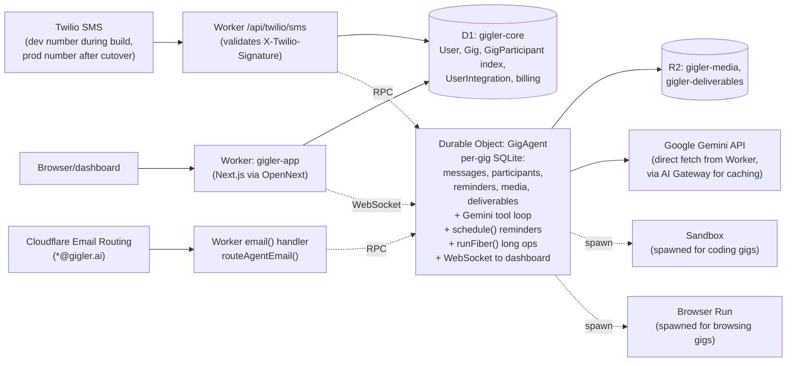
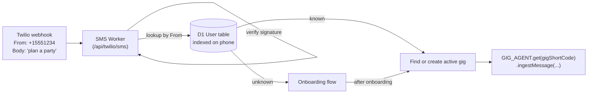
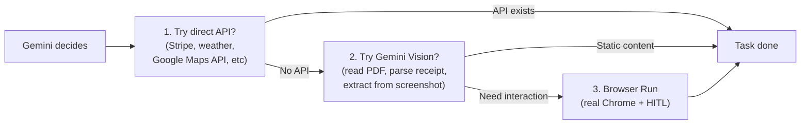
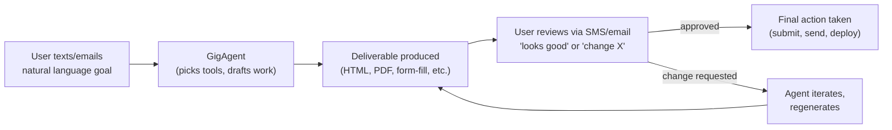

# Gigler Cloudflare Replatform

## Strategic decisions (locked)

- **Architecture**: Hybrid - **D1** for cross-tenant tables (User, Gig metadata, billing, indexes); **Durable Object per Gig** holds messages/participants/reminders/media + serves as the gig's Agent (Gemini loop, scheduling, WebSocket to dashboard).
- **Auth**: Better Auth on Workers + D1; force password reset for internal testers on cutover.
- **Deployment**: Fresh repo `gigler-cf`. Current AWS prod stays untouched. Cutover via DNS + Twilio webhook flip when validated.
- **Vision unlocks**: Real coding gigs (Sandboxes), real browsing gigs (Browser Run + HITL), email-native gigs (Agents `onEmail`), durable multi-step workflows (`runFiber`, `waitForApproval`).

## Architecture



**One Durable Object instance per gig.** ID is the gig's shortCode. Each gig is its own Agent with its own SQLite tables, alarms, and WebSocket connections. SMS and email both land in the **same** GigAgent DO directly via RPC -- no internal email-bus indirection.

---

## Inbound Routing & Multi-Tenant Identity (foundational design)

The single most important architectural pattern: **the system identifies users by their sender identity (phone or email), not by the destination they sent to.** A single shared phone number and a single shared email address can serve thousands of users correctly.

### Identity model

Two completely separate concepts:

- **Sender identity**: WHO sent it - phone number for SMS, From address for email
- **Destination**: WHERE they sent it - Gigler's Twilio number for SMS, the `*@gigler.ai` address pattern for email

The User record in D1 stores BOTH `phone` and `email` so the same human can be recognized across both channels.

### SMS inbound routing

There is one Twilio phone number shared by all users. Identity is **always** by sender (`From`).



### Email inbound routing

Cloudflare Email Routing receives all `*@gigler.ai`. Three destination patterns drive different routing:

| Destination address | Routing behavior |
|---|---|
| `gig+{shortCode}@gigler.ai` | Plus-address tells us the gig directly. `createAddressBasedEmailResolver` routes to that GigAgent. Sender's From is logged as a participant. Used for replies to per-gig auto-emails. |
| `gigs@gigler.ai` (catch-all for new gigs) | Destination is generic. Custom resolver looks at sender's From email, queries D1 User by email, routes to that user's active GigAgent (or spawns a new gig). |
| `admin@gigler.ai`, `support@`, `notifications@` | Routed to the AdminInboxAgent (a single global DO) - team email, not a per-user gig. |

```mermaid
flowchart LR
  Email["Inbound email<br/>From: alice@example.com<br/>To: gigs@gigler.ai"]
  EW["Worker email() handler"]
  Resolver["createAddressBasedEmailResolver"]
  PerGig["GIG_AGENT (specific shortCode)"]
  CatchAll["Custom resolver: lookup sender by From"]
  D1Email[("D1 User indexed on email")]
  Admin[AdminInboxAgent]
  ActiveGig[Find or create active gig for that user]

  Email --> EW
  EW --> Resolver
  Resolver -->|gig+xyz@| PerGig
  Resolver -->|gigs@| CatchAll
  Resolver -->|admin@ or support@| Admin
  CatchAll --> D1Email
  D1Email --> ActiveGig
  ActiveGig --> PerGig
```

### Multi-tenant safety guarantees

- 1,000 users texting the same Twilio number land in 1,000 different GigAgent instances based on their `From` phone number.
- 1,000 users emailing `gigs@gigler.ai` land in 1,000 different GigAgent instances based on their `From` email.
- A user texts to start a gig, then emails follow-up info → both messages land in the **same** GigAgent because the User record links phone and email to one identity, and the active gig pointer is on the User.
- A user can have multiple concurrent gigs; we determine the right gig by recency + content classification (Gemini decides "is this a new request or a continuation?").
- Group chats (Twilio Conversations or email threads with multiple `Cc`) → one gig, multiple participants, each tagged by their own sender identity in the gig's `participants` SQLite table.

### Onboarding flow for unknown senders

When `User.byPhone` or `User.byEmail` returns null:

1. Worker spawns a new User record with the known channel (phone or email)
2. GigAgent sends a welcome message asking for the missing channel ("Hey - I'm Gigler. What email should I send progress links to?") to enable cross-channel continuity later
3. Once both phone and email are linked, the User can switch channels mid-gig with no loss of context

### What we explicitly do NOT do

- **No internal SMS-to-email-bus indirection.** Both channels RPC directly into the same GigAgent DO. No extra hop, no extra cost, no extra latency. This was a pattern suggested by external sources earlier in planning; we explicitly rejected it because it adds Email Sending costs, latency, and a fragile internal contract for no architectural benefit.
- **No identifying users by destination address.** The destination only tells us routing flavor (gig-specific vs catch-all vs admin); the actual user always comes from sender headers.
- **No silent merging of unverified channels.** If a user emails from a new address claiming to be a known phone number, we require explicit linking confirmation via SMS to the known phone before merging records (prevents impersonation).

---

## Repo structure (new repo `gigler-cf` next to existing `Gigler`)

```
gigler-cf/
  wrangler.jsonc                       # Cloudflare bindings + routes
  open-next.config.ts                  # OpenNext Next.js -> Worker adapter
  package.json
  src/
    app/                               # Next.js App Router (existing UI ported over)
      api/
        twilio/sms/route.ts            # SMS webhook -> Worker -> GigAgent DO
        twilio/conversations/route.ts  # Twilio Conversations webhook
        gigs/[gigId]/messages/route.ts # Read messages via DO RPC
        auth/[...all]/route.ts         # Better Auth handler
        d/[shortCode]/route.ts         # Deliverable short links
      dashboard/[gigId]/page.tsx       # uses useAgent() WebSocket hook
      dashboard/inbox/page.tsx         # admin email inbox (Phase 4)
    lib/
      db.ts                            # D1 client (Drizzle)
      auth.ts                          # Better Auth instance (per-request)
      gemini.ts                        # ported as-is from existing repo
      twilio.ts                        # ported, signature verification via Web Crypto
  worker/
    index.ts                           # Worker entry: routeAgentEmail + Next.js fetch
    email-handler.ts                   # Inbound email -> resolver -> GigAgent or AdminInbox
  agents/
    gig-agent.ts                       # GigAgent extends Agent (per-gig DO)
    gig-agent-tools.ts                 # All Gemini tools (ported + new email tools)
    gig-agent-prompts.ts               # Ported system prompts
    admin-inbox-agent.ts               # AdminInboxAgent for *@gigler.ai admin emails
    sandbox-coder.ts                   # CoderSandbox extends Sandbox (coding gigs)
  drizzle/
    schema.ts                          # D1 tables: User, Gig, GigParticipant index, UserIntegration
    migrations/                        # Generated migrations
```

---

## Phase 0: Foundations (Week 1)

**Goal:** Empty Cloudflare app on subdomain, no Gigler logic yet, just plumbing.

- Create new repo `gigler-cf`. Scaffold via `npm create cloudflare@latest -- gigler-cf --framework=next`. Adopts OpenNext.
- Configure `wrangler.jsonc`:
  - `compatibility_date: "2026-04-17"`, `compatibility_flags: ["nodejs_compat", "experimental"]`
  - Bindings: D1 (`DB`), R2 (`MEDIA`, `DELIVERABLES`), KV (`SESSIONS`), Durable Objects (`GIG_AGENT`, `ADMIN_INBOX_AGENT`), Sandbox (`CODER_SANDBOX`), Browser (`BROWSER`), Email Sending (`EMAIL`), AI Gateway (`AI_GATEWAY`)
- Provision Cloudflare resources via wrangler:
  - D1 database `gigler-core`
  - R2 buckets `gigler-media`, `gigler-deliverables`
  - KV namespace `gigler-sessions`
- Subdomain: add `cf.gigler.ai` zone in Cloudflare; deploy worker; verify reachable.
- Generate `cloudflare-env.d.ts` via `wrangler types`.
- Wire AI Gateway in front of Gemini for caching/observability.

**Deliverable:** `https://cf.gigler.ai` shows a Next.js placeholder page running on Workers.

---

## Phase 1: Data + Auth (Week 1-2)

**Goal:** Schema migrated, auth working, no business logic yet.

- **D1 schema** (`drizzle/schema.ts`) - Drizzle ORM models for cross-tenant tables only:
  - `User` (id, email, phone, name, plan, stripeCustomerId, onboardedAt, createdAt; indexes on email + phone)
  - `Gig` (id, shortCode, title, ownerId, twilioNumber, conversationSid, status, createdAt; indexes on ownerId + shortCode + conversationSid)
  - `GigParticipantIndex` (gigId, userId, phone) - thin join for "list all gigs for user"
  - `UserIntegration` (userId, provider, encryptedTokens, createdAt)
  - `Deliverable` (id, shortCode, gigId, type, r2Key, expiresAt; index on shortCode) - kept in D1 for cross-gig short-link lookup
- **Per-gig DO SQLite tables** (defined in `agents/gig-agent.ts` `onStart()` migration):
  - `messages` (id, sender, body, mediaIds, source, createdAt)
  - `participants` (phone, userId, role, joinedAt)
  - `reminders` (id, scheduledAt, kind, payload, status)
  - `media` (id, r2Key, mimeType, sender, createdAt)
  - `state_snapshots` (for runFiber checkpointing)
- **Better Auth** (`src/lib/auth.ts`):
  - Per-request instance only (avoid the "33-second hang" pitfall from research)
  - D1 + Drizzle adapter for users, KV for sessions
  - Email/password (matches current Cognito setup), magic-link enabled for testers
  - Mount via `src/app/api/auth/[...all]/route.ts`
- Port `AuthGuard` component to use Better Auth client instead of Amplify Auth.
- Manually seed all internal tester accounts via wrangler script; send password-reset emails on day of cutover.

**Deliverable:** Sign up, log in, see empty dashboard at `cf.gigler.ai/dashboard`.

---

## Phase 2: GigAgent + SMS path (Week 2-3)

**Goal:** End-to-end SMS gig creation working on Cloudflare via dev Twilio number.

- **Provision a NEW Twilio number** ($1.15/mo) for development; point its webhook at `cf.gigler.ai/api/twilio/sms`. Production number stays on AWS.
- **GigAgent** (`agents/gig-agent.ts`) - the per-gig Durable Object:
  - `extends Agent` from `agents` SDK
  - Methods: `ingestMessage(msg)`, `processWithGemini()`, `scheduleReminder(at, kind)`, `state()` for dashboard
  - Uses `runFiber("gemini-loop", ...)` so multi-tool Gemini runs survive DO eviction
  - Uses `this.schedule(at, "fireReminder", payload)` for reminders (replaces EventBridge cron + DynamoDB scan)
  - Uses `setState()` to push live updates to dashboard WebSocket subscribers
- **Tools port** (`agents/gig-agent-tools.ts`) - lift declarations from current `gigler-gig-processor/handler.ts`:
  - `add_participant`, `remove_participant`, `set_title`, `schedule_reminder`, `request_media`, `create_deliverable`, `mark_complete`, etc.
  - All tools call DO methods or RPC into other DOs/services - no DynamoDB SDK needed
- **System prompts port** (`agents/gig-agent-prompts.ts`) - copy from existing `gig-processor`, replace any AWS-specific verbiage.
- **SMS Worker route** (`src/app/api/twilio/sms/route.ts`):
  - Verify `X-Twilio-Signature` via Web Crypto HMAC-SHA1 (don't make verifier async returning a promise - research flagged this is the #1 footgun)
  - Look up sender in D1 (`User.byPhone`)
  - Onboarding flow if new user
  - Look up active gig OR create new gig + DO instance
  - RPC into `GIG_AGENT.get(gigId).ingestMessage(...)`
- **Twilio Conversations webhook** (`src/app/api/twilio/conversations/route.ts`) - same pattern, different payload shape.
- **Media upload** - port `gigler-media-processor` logic into a `processMedia()` method on GigAgent: download MMS bytes, upload to R2 via `env.MEDIA.put(key, body)`, store row in DO's `media` table.

**Deliverable:** Text the dev Twilio number, see gig get created in `cf.gigler.ai/dashboard`, AI replies, reminders fire.

---

## Phase 3: Dashboard with realtime + deliverables (Week 3-4)

**Goal:** Dashboard pages match current Gigler UX, plus realtime updates.

- Port `/dashboard` and `/dashboard/[gigId]/page.tsx` from existing repo. Replace AppSync queries with:
  - **D1 query** for gig list (`useGigList()` hook hits a route that queries D1)
  - **`useAgent({ agent: 'GigAgent', name: gigId })`** for live gig state + WebSocket pushes (replaces polling). State updates flow automatically.
- Port `S3Image` component to a `R2Image` that fetches signed URLs from a Worker route.
- Port deliverable short-link flow:
  - `/api/d/[shortCode]` - D1 lookup, R2 fetch
  - `/api/d/[shortCode]/verify` + `/confirm` - port phone OTP via Twilio (already provider-agnostic)
- Port deliverable generator using the **HTML-to-PDF-via-Chrome** workflow (validated manually during the NVIDIA Inception field test, see Phase 6 Field Notes section). The agent generates a self-contained HTML file with embedded CSS, then uses headless Chrome (via Browser Run in production, or `@cloudflare/sandbox` for self-hosted) to print to PDF. This produces visually rich, designed deliverables (pitch decks, reports, menus, invoices, photo albums) far beyond what `pdf-lib` can do programmatically. PDF written to R2, short link sent back via SMS/email.

**Deliverable:** Full UX parity with current Gigler dashboard, but realtime instead of polling.

---

## Phase 4: Email-native (Week 4)

**Goal:** Inbound + outbound email working via Cloudflare Email Service.

- **DNS prep** (NOT executed yet - just configured): document the gigler.ai DNS changes needed for Email Routing (MX records, SPF, DKIM auto-config). Will execute on cutover.
- **AdminInboxAgent** (`agents/admin-inbox-agent.ts`) - one DO that owns all admin emails (`admin@`, `support@`, `notifications@`):
  - `onEmail` parses MIME via PostalMime, persists thread to its SQLite
  - Dashboard route `/dashboard/inbox` uses `useAgent({ agent: 'AdminInboxAgent', name: 'global' })` for live inbox
  - Reply via `this.replyToEmail(email, { ... })` from a UI action
- **Per-gig email** - extend GigAgent.onEmail: address pattern `gig+{shortCode}@gigler.ai`. The `email()` Worker handler dispatches via `createAddressBasedEmailResolver` to the right `GIG_AGENT` instance. **Email and SMS both land in the same DO** -- agent state is unified across channels automatically.
- **Email Sending** (still beta as of April 2026): use binding `env.EMAIL.send(...)` for outbound. Keep AWS SES fallback in code as escape hatch.
- **Mail-loop guards**: check RFC 3834 `Auto-Submitted` header; never reply to auto-replies.
- **Secure reply routing**: use `createSecureReplyEmailResolver(env.EMAIL_SECRET)` so HMAC-signed agent IDs in headers prevent reply hijacking.

**Deliverable:** On a dev DNS subdomain, send to `admin@`, see in dashboard, reply, recipient gets it.

---

## Phase 5: Sandboxes for coding gigs (Week 4-5)

**Goal:** Greenfield - "build me a website" gigs that actually scaffold and deploy code.

- **CoderSandbox** (`agents/sandbox-coder.ts`):
  - `extends Sandbox` from `@cloudflare/sandbox`
  - `outboundByHost` injects GitHub/Vercel/Netlify tokens at egress proxy layer (agent never sees them)
  - Methods: `cloneTemplate(templateUrl)`, `runCommand(cmd)`, `previewUrl()` (background dev server), `commitAndPush()`
- **GigAgent integration**: when a gig is classified as `code_project`, call `env.CODER_SANDBOX.get(gigId)` and expose new tools to Gemini:
  - `coding_clone_template`, `coding_run_command`, `coding_preview_url`, `coding_commit_push`, `coding_request_review` (uses `waitForApproval()`)
- **Live preview in dashboard**: dashboard shows `previewUrl` in iframe so user sees their site as the agent builds it.

**Deliverable:** Text "build me a one-page portfolio site for John Smith, a photographer", get a live preview URL within minutes, code committed to a repo.

---

## Phase 6: Browser Run for browsing gigs (Week 5-6)

**Goal:** Greenfield - "apply to NVIDIA Inception", "book a reservation", "pay this bill".

### Tool selection: easiest path first

The GigAgent should always pick the cheapest, simplest tool that gets the job done. The system prompt teaches Gemini to follow this priority order:



### Concrete examples (Browser Run is needed when modern web prevents simpler approaches)

| Task | Best tool |
|---|---|
| "Get the lunch menu at Joe's Diner" (static HTML site) | Direct fetch + Gemini parse |
| "What's the weather in NYC tomorrow" | Weather API |
| "Pay my Comcast bill" | Browser Run (React SPA + login + CSRF) |
| "Book a table for 4 at OpenTable Saturday 7pm" | Browser Run (SPA, anti-bot) |
| "Apply to NVIDIA Inception with my company info" | Browser Run + HITL (multi-step form, possibly CAPTCHA) |
| "Check my Amazon order status" | Browser Run (login, anti-bot, SPA) |
| "Read this PDF I texted you and tell me the bill total" | Gemini Vision (no browser needed) |
| "Find me 3 plumbers near 90210 with reviews" | Google Places API first; Browser Run fallback |
| "Submit my LLC formation to the Texas SOS website" | Browser Run + HITL (state portals are wonky) |
| "Cancel my Netflix subscription" | Browser Run + HITL (SPA, login, click flow) |

### Browser Run tools

- New tools on GigAgent backed by Browser Run:
  - `browse_open_url`, `browse_fill_form(selector, value)`, `browse_click(selector)`, `browse_screenshot()`, `browse_extract_text(selector)`
  - Each tool gets a Browser Run session pinned to the gig DO via `env.BROWSER.launch()` then session reuse
- **Human-in-the-loop**: when login pages or CAPTCHAs are hit, agent calls `browse_request_human()` -> sends user a Live View URL via SMS/email + `waitForApproval()` until human takes over and hands back.
- **Live View embed** in dashboard for transparency.
- **Session recordings** auto-saved to R2 for debugging.

### Cost guardrails (built into Phase 6)

Browser Run is metered at $0.09/browser-hour with a $2/mo/extra-concurrent fee. To prevent runaway costs from stuck agents or aggressive users:

1. **Per-gig minute cap**: hard limit of 30 minutes of Browser Run time per gig before requiring user confirmation to continue. Configurable per plan tier.
2. **Idle-session detection**: GigAgent must `browser.close()` immediately when waiting on `waitForApproval()` or user input. Re-launch when resumed. Never pay for an idle browser.
3. **User-facing meter in dashboard**: show "browser-minutes used" per gig and per billing period.
4. **Plan tiers** (enforce in GigAgent before launching browser):
   - Free plan: 10 minutes browsing/month total
   - Paid plan: 5 hours browsing/month included, then user is asked to upgrade
5. **Concurrency budget**: tracked in D1; if account is over its included concurrent-browser allowance, queue tasks instead of paying overage.

**Deliverable:** Text "apply to NVIDIA Inception with my company info", agent fills form, hits login wall, sends user Live View link, user logs in, agent finishes, confirmation SMS. Cost meter visible in dashboard.

---

## Phase 6 Field Notes: Manual NVIDIA Inception Application Walkthrough

Captured live during a manual end-to-end attempt to apply to NVIDIA Inception using the in-IDE browser MCP. These are real-world findings that the production GigAgent must handle.

### The product's core orchestration loop (validated)

This walkthrough validated what the product actually feels like:



**Key insight: "AI does powerful things in the background while the human stays in control via simple text/email/voice."** The user never opens an app, never edits HTML, never logs into Cloudflare. They just text "make the deck blue instead of green" or "remove the founder name" and the agent regenerates and re-shares. This iteration loop is the core product.

### Validated workflow: HTML to Chrome to PDF for designed deliverables

During this session we built a 10-slide pitch deck purely from the agent side. The pattern that worked beautifully:

1. **Agent writes HTML** with embedded CSS targeting a 13.33in x 7.5in landscape page (`@page { size: 13.333in 7.5in; }`)
2. **Agent uses Sandbox** to invoke `chrome --headless --print-to-pdf=output.pdf file://path/to/deck.html`
3. **Agent writes PDF to R2**, generates short link
4. **Agent sends short link** to user via SMS/email
5. **User reviews and texts feedback** ("change color to blue", "remove emojis", "add a slide about traction")
6. **Agent edits HTML, regenerates, re-shares** - loop until user says "looks good"
7. **Final delivery**: agent uploads PDF where it needs to go (form attachment, email attachment, R2 archive)

Reference implementation produced this session: [pitch-deck/deck.html](pitch-deck/deck.html) and [pitch-deck/gigler-pitch-deck-v4.pdf](pitch-deck/gigler-pitch-deck-v4.pdf).

**Why this beats `pdf-lib` programmatic generation:**
- HTML+CSS gives full design control (typography, color, layout, code-syntax highlighting)
- Designs look human-made, not template-generated
- Iteration is just edit-the-HTML, no PDF library calls to rewrite
- Same HTML can be viewed in browser AND printed to PDF (single source)
- LLMs are vastly better at writing HTML than calling pdf-lib APIs

**Tool definition for GigAgent:**
- `deliverable_html_to_pdf(html_string, filename)` - writes HTML, runs Chrome, uploads PDF to R2, returns short link
- `deliverable_iterate(short_link, edit_instructions)` - reads stored HTML, asks Gemini to apply edits, regenerates PDF
- `deliverable_attach_to_form(short_link, browser_session_id, file_field_ref)` - uploads stored PDF into a Browser Run form

### Technical recipe (exact pattern used during this session)

This is the literal HTML+CSS+Chrome recipe that produced [pitch-deck/gigler-pitch-deck-v4.pdf](pitch-deck/gigler-pitch-deck-v4.pdf). The agent should generate documents using this same scaffold.

**CSS scaffold (must include, top of every deliverable HTML):**

```css
@page { size: 13.333in 7.5in; margin: 0; }   /* Landscape 16:9. For letter portrait use: 8.5in 11in */
* {
  margin: 0; padding: 0; box-sizing: border-box;
  -webkit-print-color-adjust: exact;             /* CRITICAL: preserves backgrounds/colors in PDF */
  print-color-adjust: exact;
}
.slide {
  width: 13.333in; height: 7.5in;
  page-break-after: always;                      /* one slide per page */
  position: relative; overflow: hidden;
}
.slide:last-child { page-break-after: auto; }
```

The two non-obvious requirements: `print-color-adjust: exact` (or backgrounds/colors render as white in PDF) and `page-break-after: always` (or all content collapses into one page).

**Page sizes (for the agent's reference):**

| Deliverable type | `@page size` | Notes |
|---|---|---|
| Pitch deck / presentation | `13.333in 7.5in` | Standard 16:9 widescreen |
| Letter portrait (report, invoice) | `8.5in 11in` | US default |
| A4 portrait (international) | `210mm 297mm` | EU/Asia default |
| Square photo album | `8in 8in` | Family album use case |
| Restaurant menu (tabloid) | `11in 17in` | Single sheet, foldable |

**Generation in current local environment (used this session):**

```bash
"/Applications/Google Chrome.app/Contents/MacOS/Google Chrome" \
  --headless --disable-gpu \
  --print-to-pdf="output.pdf" \
  --print-to-pdf-no-header \
  --no-margins \
  --virtual-time-budget=5000 \
  "file:///absolute/path/to/deck.html"
```

Key flags:
- `--print-to-pdf-no-header` strips the URL/timestamp Chrome normally adds
- `--no-margins` honors the `@page { margin: 0 }` CSS
- `--virtual-time-budget=5000` waits up to 5s for fonts, images, JS to settle before snapshotting

**Generation in production (Cloudflare Browser Run via Puppeteer):**

```typescript
// agents/gig-agent-tools/deliverable-html-to-pdf.ts
import puppeteer from "@cloudflare/puppeteer";

export async function deliverableHtmlToPdf(env: Env, opts: {
  html: string;
  filename: string;
  pageSize?: { width: string; height: string };  // default: 16:9 widescreen
  gigId: string;
}): Promise<{ shortCode: string; r2Key: string; bytes: number }> {
  const browser = await puppeteer.launch(env.BROWSER);
  const page = await browser.newPage();

  await page.setContent(opts.html, { waitUntil: "networkidle0" });

  const pdfBuffer = await page.pdf({
    width: opts.pageSize?.width ?? "13.333in",
    height: opts.pageSize?.height ?? "7.5in",
    printBackground: true,                       // equivalent to -webkit-print-color-adjust: exact
    margin: { top: 0, right: 0, bottom: 0, left: 0 },
    preferCSSPageSize: true,                     // honors @page rule from CSS
  });

  await browser.close();

  const r2Key = `deliverables/${opts.gigId}/${opts.filename}`;
  await env.DELIVERABLES.put(r2Key, pdfBuffer, {
    httpMetadata: { contentType: "application/pdf" },
  });

  const shortCode = generateShortCode();
  await env.DB.prepare(
    "INSERT INTO Deliverable (shortCode, gigId, type, r2Key, createdAt) VALUES (?, ?, 'pdf', ?, ?)"
  ).bind(shortCode, opts.gigId, r2Key, Date.now()).run();

  return { shortCode, r2Key, bytes: pdfBuffer.byteLength };
}
```

**Why Browser Run instead of Sandboxes for this**: PDF generation is a one-shot stateless render. Browser Run charges $0.09/browser-hour and a typical PDF render takes 2-5 seconds (~$0.0002 per PDF). Sandboxes would require installing Chromium per session and pay for CPU time. Browser Run wins on simplicity and cost.

**Iteration storage pattern (so `deliverable_iterate` works):**

When the agent generates a PDF, it must also persist the source HTML alongside the PDF in R2:

```
deliverables/{gigId}/{filename}.pdf       <- the rendered PDF
deliverables/{gigId}/{filename}.html      <- the source HTML (for iteration)
deliverables/{gigId}/{filename}.meta.json <- Gemini context: prompt, version, parent shortCode
```

Then `deliverable_iterate(shortCode, "make it blue instead of green")`:
1. Loads `.html` and `.meta.json` from R2
2. Sends to Gemini: "Here is the current HTML. The user wants: {edit_instructions}. Return only the new HTML."
3. Calls `deliverableHtmlToPdf` again with the new HTML and a `-v2` filename
4. Updates the meta.json `parent` chain so version history is queryable
5. Sends new short link via SMS/email

**Versioning convention:** suffix files with `-v1`, `-v2`, `-v3` so each iteration is a distinct deliverable. The Deliverable D1 row keeps a `parentShortCode` foreign key so you can trace lineage and roll back.

### Real-world friction encountered (NVIDIA application surface)

| # | Friction | What happened | Production handling needed |
|---|---|---|---|
| 1 | Cookie consent overlay | First click was intercepted by an OneTrust banner blocking the entire page | Agent must dismiss cookie/consent overlays before any other interaction. Pre-trained selector list of common consent dialog patterns (OneTrust, TrustArc, Cookiebot, etc.) |
| 2 | Apply button opened new tab | URL didn't change after click; new tab opened silently | Agent must call `browser_tabs list` after every click that doesn't change URL |
| 3 | Salesforce LWR + Locker Service | `browser_fill` and `browser_type` both failed with focus errors. The page is built on Salesforce Lightning Web Runtime; Locker sandboxes intentionally block synthetic input events | Production agent needs alternative form-fill strategy: mouse-click coordinates from a fresh screenshot, then character-by-character keyboard typing. Or use Stagehand-style intent-based actions that bypass element-level event injection. |
| 4 | NVIDIA's own UI bug | Email input placeholder showed "undefined" instead of "Enter your business email" - likely a JS race condition in their LWR app | Agent must not assume placeholder text is meaningful; use field name/label from accessibility tree |
| 5 | Email alias detection more aggressive than docs | NVIDIA docs say "info@ aliases not accepted." Reality: `admin@`, `support@`, `notifications@`, etc. all rejected. Pattern: any role-style local-part is blocked | Agent must keep a canonical "personal-format business email" for the user (e.g., `firstname@domain`) separate from operational emails. Pre-flight rule: never use admin/support/info/hello/contact/notifications local-parts for application forms. |
| 6 | Account creation gated by email verification | NVIDIA sends a verification email with a one-time code/link before allowing form access. Required HITL handoff to user | Agent needs `wait_for_verification_email(domain)` tool that polls inbox via `onEmail` for OTP/link, then resumes |
| 7 | Pre-fill from website scraping | NVIDIA auto-scraped gigler.ai and pre-populated 5 fields (company name, HQ, year, employees, business status). Some pre-fills were guesses (year 2026, 7 employees) | Agent should always present pre-filled values to user for confirmation before submitting; never blindly accept pre-fills |
| 8 | Required-field marking is reactive | "Total Funding Raised" showed `[required, invalid]` only after the form was loaded. Some fields are conditionally required based on other answers | Agent must validate the entire form state, not just initial required markers, and re-check after every field change |
| 9 | File upload field for pitch deck | Required upload field with no obvious file requirements (size, format) | Agent needs a "deliverable cache" so it can produce a pitch deck on-demand from gig context, not require user to upload one |
| 10 | Two-contact requirement (developer + executive) | Application requires unique business emails for two distinct people. Solo founders/early teams won't have this | Agent must surface this requirement upfront and either suggest co-founder workaround or flag the user can't qualify yet |

### What an agent could do better than a human (here, specifically)

- **Pitch deck on demand**: human had to "go make a pitch deck" mid-application; agent generates it from gig context in 30 seconds and iterates via text
- **Boilerplate company description**: 200-1000 character description was the slowest field for the human; agent drafts in one pass with all the context it has
- **Cross-application consistency**: agent remembers what was submitted to NVIDIA, can reuse the same content for Y Combinator, Techstars, etc. with appropriate tonal adjustments
- **Verification email handling**: agent reads its own inbox via `onEmail`, no tab-switching for the human
- **Resume-on-failure**: if browser session times out or user closes laptop, agent's `runFiber()` resumes the application from the last completed step

### What still requires the human (Phase 6 HITL hand-offs)

- The initial NVIDIA developer account login (passwords, MFA setup)
- CAPTCHAs (if encountered)
- Final review/approval before form submission
- Investor names (private knowledge agent doesn't have)
- Sensitive financial figures the user wants to control

### Tool requirements added to Phase 6 implementation list

- `dismiss_consent_overlay()` - pattern-matches and dismisses common cookie/consent dialogs
- `wait_for_new_tab(timeout_ms)` - detects tab spawned by previous click
- `mouse_type_via_coords(x, y, text)` - fallback for LWC/shadow-DOM/Locker-protected inputs
- `wait_for_verification_email(domain, timeout_min)` - hooks into `onEmail` to extract OTP or magic link
- `confirm_prefilled_values(field_map)` - sends user a summary of pre-filled values via SMS for approval before submit
- `deliverable_html_to_pdf(html, filename)` - the validated HTML-to-Chrome-to-PDF pipeline
- `deliverable_iterate(short_link, instructions)` - feedback-loop edit on a previously generated deliverable
- `application_resume(application_id)` - resume a multi-page form from last saved checkpoint

---

## Headless Chrome Capability Surface (cross-cutting)

Headless Chrome via Cloudflare Browser Run is one of the highest-leverage primitives in the stack. Same `puppeteer.launch(env.BROWSER)` engine, many output modes. Roll out in priority order across phases:

### P1 - Built in Phase 6 alongside the deliverable pipeline

**1. PDF generation for designed deliverables** (already documented above): pitch decks, reports, invoices, menus, photo albums, year-in-review, restaurant menus.

**2. PNG generation for MMS deliverables** - **strategic unlock**

This turns SMS into a content channel. Twilio MMS can carry images. Same HTML scaffold as PDFs, but `page.screenshot()` instead of `page.pdf()`. Unlocks consumer use cases:

- "Here's the recap" cards: sports games, parties, daily highlights
- Personalized event invitations (kid's name, date, RSVP shortcode embedded)
- Bill dashboard snapshots: "Here are your June bills" as one image
- Schedule/calendar images: "Your week ahead at a glance"
- Year-in-review shareable cards
- Auto-generated social-share OG images

Tool: `deliverable_html_to_png(html, viewport)` returns shortCode + R2 key + width/height for MMS-ready image.

```typescript
const browser = await puppeteer.launch(env.BROWSER);
const page = await browser.newPage();
await page.setViewport({ width: 1080, height: 1920 });   // mobile-portrait MMS-friendly
await page.setContent(html, { waitUntil: "networkidle0" });
const png = await page.screenshot({ type: "png", fullPage: false });
```

### P2 - Built in Phase 5 alongside Sandboxes

**3. Visual verification of code outputs** - **critical for trust**

When CoderSandbox deploys a site, agent screenshots it before sending the preview link to the user:
- Desktop screenshot at 1440x900
- Mobile screenshot at 375x812
- "Here's how your dog-walking site looks" via MMS, alongside the live URL via SMS

Tool: `coding_screenshot_preview(deployUrl, viewports)` - returns array of MMS-ready images.

**4. Lighthouse audits for code outputs**

After deploy, run Lighthouse via Chrome DevTools Protocol:
- Performance, Accessibility, SEO, Best Practices scores
- Surface findings in plain English: "Your site scored 94 on performance. One image is missing alt text - I'll fix it if you say go."

Tool: `coding_lighthouse_audit(deployUrl)` - returns scores + actionable findings.

**5. Visual regression diff between code versions**

Before/after the agent edits a site:
- Render both versions, pixel-diff
- "Here's what changed" diff image attached to commit

Tool: `coding_visual_diff(beforeUrl, afterUrl, viewports)` - returns side-by-side comparison PNG.

### P3 - Built in Phase 6 alongside Browser Run web tasks

**6. Web archival / proof of work**

Every action the agent takes on the user's behalf via Browser Run gets a screenshot of the confirmation page:
- "I submitted your NVIDIA application - here's the confirmation screen" + screenshot
- "I cancelled your Netflix - here's what they showed me" + screenshot
- "Comcast bill paid - here's the receipt" + screenshot

Stored permanently in R2. Searchable from the dashboard. Irrefutable proof.

Tool: `browse_capture_proof(label)` - automatic screenshot + metadata write to D1.

**7. Dynamic OG images for shared deliverable links**

When a user shares `gigler.ai/d/xyz` on iMessage / Slack / Twitter / LinkedIn:
- The link's `<meta property="og:image">` points to a Worker route
- Worker uses Browser Run to render an HTML template with deliverable metadata
- PNG cached in KV (TTL 7 days) so subsequent shares are instant

Tool: built into the Worker route serving `gigler.ai/og/{shortCode}.png` - not a GigAgent tool per se, but uses the same Browser Run binding.

**8. Email rendering preview**

Before agent sends an HTML email, render it as Gmail/Outlook will display:
- Catches dark-mode breakage, missing fonts, broken layout
- "Here's what they'll see when they open it" preview MMS to user

Tool: `email_preview_render(htmlBody)` - returns PNG of rendered email body.

### P4 - Nice-to-have, build when justified

**9. Charts and data visualizations** - render Chart.js / D3 / Observable Plot in HTML, screenshot or PDF. LLMs are bad at generating chart images directly; great at writing chart-library JS.

**10. Receipt re-rendering for Vision fallback** - if Gemini Vision struggles with a receipt photo, render the source PDF/email as PNG and re-Vision with cleaner input.

### Cost model for Headless Chrome usage

Browser Run = $0.09/browser-hour. Typical operation timings:
- PDF render: ~3-5s (~$0.0001 per PDF)
- PNG render: ~2-3s (~$0.00007 per PNG)
- Lighthouse audit: ~30-45s (~$0.001 per audit)
- Web action with capture: ~10-30s per task (~$0.0003-0.001)

At consumer scale (1000s of MMS-image deliverables/day), monthly Browser Run cost stays under $50. The constraint is concurrency (120 simultaneous browsers on Paid), not cost - which is why aggressive idle-detection and session reuse from Phase 6 cost guardrails matter.

---

## Phase 7: Cutover (Week 6)

**Goal:** Flip production to Cloudflare; decommission AWS Amplify backend.

- **Pre-cutover validation**: 1-2 weeks of dual operation - testers use Cloudflare via cf.gigler.ai with dev Twilio number.
- **Cutover day checklist**:
  1. Email all internal testers - "we're moving, please reset your password at cf.gigler.ai"
  2. Update DNS: `gigler.ai` apex points at Cloudflare Worker (not Amplify Hosting)
  3. Update DNS: MX records for `gigler.ai` -> Cloudflare Email Routing (was SES)
  4. Twilio: change production phone number webhook URL from AWS Lambda Function URL to `gigler.ai/api/twilio/sms`
  5. Stripe webhooks: re-point to new Cloudflare endpoint
  6. Monitor logs for 48 hours
- **Decommission (after 1 week of stable operation)**:
  - Disable Amplify pipeline deploys
  - Take final DynamoDB snapshot, archive to R2
  - Drop AWS Lambda functions
  - Cancel SES domain verification (production access stays for safety)
  - Keep Cognito user pool dormant for 30 days as user-data backup
  - Final AWS bill: nearly zero

**Deliverable:** `gigler.ai` runs on Cloudflare. AWS bill drops to ~$0/mo.

---

## What this plan deliberately does NOT include

- **No SAML/OIDC enterprise auth** - Better Auth handles email/password + magic links. Add later if enterprise customers need it.
- **No Voice/realtime audio yet** - existing `gigler-voice-bridge` is currently SMS fallback. Real Gemini Live or Pipecat integration is a separate later phase.
- **No Stripe migration work** - Stripe SDK works identically from Workers; no schema changes needed for billing.
- **No data migration of existing test gig data** - testers will start fresh on Cloudflare. We're not building a DDB->D1/DO migration tool because the data isn't valuable enough to justify the engineering cost.
- **No automatic AWS decommission scripts** - manual checklist only, to avoid accidental data loss.
- **No internal SMS-to-email-bus indirection**. Our SMS and email both RPC directly into the same GigAgent DO -- no extra hop, no extra cost.
- **No "terminal browser" / text-mode HTML scraper as a pre-Browser-Run fallback**. Modern web (React SPAs, anti-bot detection, OAuth flows, CAPTCHAs, iframes) makes text-only scraping fail on ~70-80% of useful tasks. The "easiest path first" priority order in Phase 6 is: direct API > Gemini Vision > Browser Run. No scrape-only tier in between.

## Risk register

- **Email Sending is still beta as of April 2026**. Pricing TBC ($0.35/1k according to current docs vs SES $0.10/1k). Mitigation: keep SES code paths in helper modules as fallback for transactional mail; only commit to Cloudflare-only for inbound (which is GA).
- **Agents SDK API surface changes fast** (fibers refactored April 2026, sub-agents not first-class yet). Mitigation: pin `agents` package version, gate upgrades on changelog review.
- **OpenNext does not yet support Next.js Node middleware**. Mitigation: audit current middleware before porting; rewrite if needed.
- **D1 row-scan billing surprise**. Mitigation: explicit indexes on every WHERE clause column; CI lint to enforce.
- **Per-gig DO SQLite is hard-isolated** - cannot do `JOIN` across gigs. Cross-gig analytics must go through D1. Mitigation: dual-write key fields (gigId, ownerId, status) to D1 for analytics; per-gig truth lives in DO.

## Total estimated time

- **6 weeks of solo build time** assuming ~30 focused hours/week.
- **~$30/mo** Cloudflare paid plan + Twilio dev number ($1.15/mo) during build period.
- **Production cost after cutover**: estimated $30-80/mo for current load (Workers Paid $5 + DO compute + R2 storage + Browser Run usage + Sandbox active CPU + Email Sending). Compare to current AWS bill.

## What I need from you to start Phase 0

1. Confirm: create new repo `gigler-cf` as a sibling to `Gigler`? Or fresh GitHub org? Or branch within current repo?
2. Cloudflare account: do you have a Workers Paid plan ($5/mo)? Phase 0 needs it for DO + R2 + AI Gateway.
3. `gigler.ai` zone: is it currently on Cloudflare DNS or another DNS provider? (Cloudflare Email Routing requires Cloudflare to be authoritative.)
4. Once those are confirmed I'll switch to agent mode and start Phase 0.
