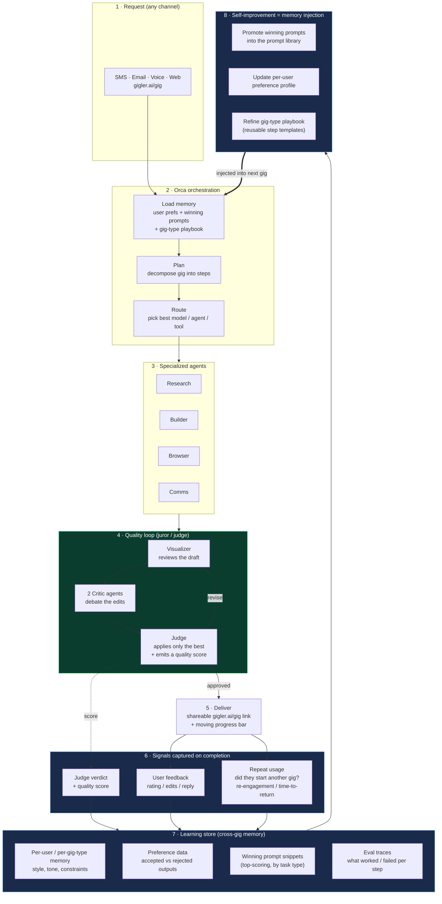

# Gigler — Self-Improving Gig Loop

> How Gigler gets better with **every gig**. Built on the existing **Orca** model
> (plan → route → execute → verify) plus a learning loop driven by the juror/judge
> agents and by user signals (explicit feedback + whether they come back).

Gigler runs **two nested loops**:

- **Inner loop — quality per gig** (the juror/judge "quality loop"): makes *this*
  gig good before it ships.
- **Outer loop — self-improvement across gigs**: captures signals on completion,
  writes them to a **learning store**, and **injects that memory into the context
  of the next gig**. No model training — pure in-context learning (fast, cheap,
  reversible).

---

## Diagram

---

## How to read it

### Inner loop — quality per gig (step 4)
The juror/judge agents iterate on a draft: the **Visualizer** reviews it, **two
Critic agents debate** the edits, and the **Judge** applies only the best changes
and emits a **quality score**. Only approved work ships. This makes *this* gig good.

### Outer loop — self-improvement across gigs (steps 6 → 8 → back to 2)
On completion, Gigler captures **three signals**:

| Signal | Source | What it tells us |
|---|---|---|
| **Judge verdict + score** | Quality loop (automated) | Was the output objectively good? |
| **User feedback** | Rating, edits, the reply they send | Did the human accept/like it? |
| **Repeat usage** | Did they start another gig, and how fast? | Did it earn their trust? |

These flow into the **learning store**, then become **memory that's injected into
the next gig's context** at step 2 — so Orca starts the next gig already knowing
the user's preferences, the best prompts for that task type, and a refined playbook.

---

## The learning mechanism: in-context memory (no training)

Improvement happens by **changing what we put in the context window**, not by
retraining models. Three things get written and later injected:

1. **Per-user preference profile** — style, tone, format, recurring constraints
   ("always metric units", "casual voice", "no emojis"). Built from accepted
   outputs and edits.
2. **Winning prompt snippets** — for each gig type, the top-scoring prompt
   fragments (by Judge score + acceptance) are promoted into a reusable library.
3. **Gig-type playbook** — reusable step templates: the plan/route decisions that
   produced high-scoring, repeat-driving gigs become the default starting plan.

On the next gig, Orca's **"Load memory"** step pulls the relevant profile +
playbook + winning prompts and prepends them to the working context. Cheap,
instant, and fully reversible (bad memory can just be dropped).

---

## Where this lives in the current codebase

This loop reuses Gigler primitives that already exist — no new training infra:

| Concept in the diagram | Where it maps today |
|---|---|
| Per-user preference profile | `User.preferences` (JSON) in `amplify/data/resource.ts` |
| Gig-type playbook / gig state | `Gig.metadata` (JSON) |
| Prompt library | `GIG_TYPE_PROMPTS` in `gigler-gig-processor/prompts.ts` |
| Judge / quality loop | `gigler-gig-processor` (Orca quality loop) |
| Signal capture on completion | Gig completion path in `gigler-gig-processor` + `gigler-inbound-sms` |
| Repeat-usage signal | Derivable from `Gig.byOwner` (new gigs per user over time) |

**New piece to add:** a small **learning store** — either a dedicated
`GigOutcome` / `LearnedMemory` model, or structured fields appended to
`User.preferences`. It records `{ gigType, judgeScore, userRating, accepted,
returnedWithinDays, winningPromptSnippet }` and exposes a "fetch memory for this
user + gig type" read that the processor injects at the start of each gig.

---

## Suggested phasing

1. **Capture** — log the three signals on every gig completion (write to the
   learning store). Pure instrumentation; changes no behavior yet.
2. **Inject** — at gig start, load the per-user profile + gig-type playbook and
   prepend to context.
3. **Promote** — periodically roll up top-scoring prompts per gig type into the
   prompt library; demote losers.

Later, if there's enough volume, the same preference data can graduate to
routing-optimization or fine-tuning — but in-context memory is the cheap,
high-leverage first step.
