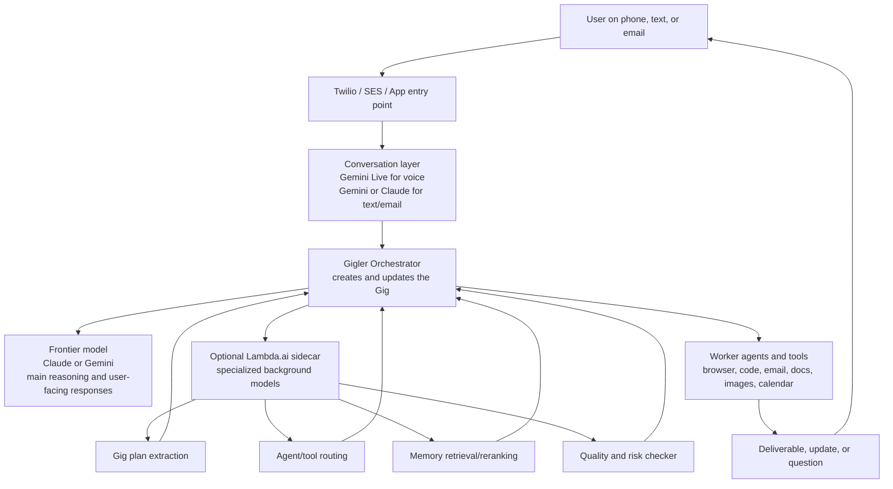
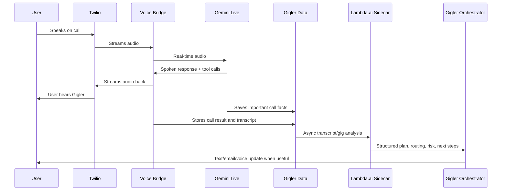
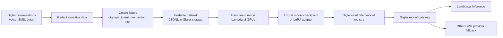

# Lambda.ai + Gemini Voice Strategy for Gigler

## Short answer

Gigler should **keep Gemini Live for real-time voice** and use Lambda.ai only as an optional backend layer for training, evaluation, routing, memory, and heavier background work.

The safest path is:

- Gemini Live handles the live phone call.
- Claude, Gemini, or another frontier model handles high-level orchestration while the product is still moving fast.
- Lambda.ai is used for experiments that can become Gigler-owned infrastructure later: classifiers, routing models, quality checks, memory/reranking, and fine-tuned adapters.

Do not rebuild the working voice stack just to use Lambda credits.

---

## Lock-in risk

Using Lambda.ai for GPU compute does **not automatically lock Gigler into Lambda.ai**, as long as we structure it correctly.

The lock-in happens if:

- the trained model is stored only inside a provider-specific managed service;
- the inference endpoint has provider-specific behavior that the app depends on;
- training data, checkpoints, adapters, or evaluation sets are not exported;
- Gigler calls Lambda directly from core product code everywhere.

The portable version is:

- train open-source models or adapters;
- store training data and eval sets in Gigler-controlled storage;
- export checkpoints or LoRA adapters to S3, Hugging Face, or another controlled registry;
- call all non-frontier models through a small internal `model-gateway` service;
- make Lambda.ai one backend option behind that gateway.

In plain English: **rent Lambda's GPUs, do not make Lambda the owner of Gigler's brain.**

---

## Should we just use Claude for orchestration?

For now, yes, Claude or Gemini is probably easier for the main orchestration brain.

Reasons:

- faster to build;
- better general reasoning;
- no model ops burden;
- fewer moving parts;
- easier to debug while product-market fit is still forming.

But that does not mean Lambda.ai is useless. Lambda.ai becomes valuable when Gigler has repeated internal tasks that are expensive, frequent, or proprietary enough to deserve their own model.

Good Lambda.ai candidates:

- request classification;
- gig type routing;
- urgency detection;
- safety/risk scoring;
- transcript-to-gig-plan extraction;
- quality review before sending a user update;
- memory retrieval and reranking;
- document/photo/video preprocessing;
- small specialized models trained on Gigler's own patterns.

Bad first Lambda.ai candidates:

- replacing Gemini Live voice;
- replacing Claude/Gemini as the main reasoning brain too early;
- live audio turn-taking;
- anything that must work instantly during a phone conversation.

---

## Recommended architecture



---

## How this fits the current voice bridge

The existing voice bridge already has the right split:



Lambda.ai should sit **after or beside** the live call, not inside the live audio path at first.

---

## Best first Lambda.ai experiment

Build a **Post-Call Orchestration Analyst**.

Input:

- transcript;
- extracted call facts;
- current gig state;
- user preferences;
- recent messages;
- available tools/agents.

Output:

```json
{
  "gig_type": "trip_planning",
  "user_goal": "Plan group activities for a weekend trip",
  "next_actions": [
    "Create shared trip page",
    "Suggest 5 activity options",
    "Ask group for budget and mobility constraints"
  ],
  "suggested_channel": "group_sms",
  "needs_user_confirmation": true,
  "confidence": 0.82,
  "risk_flags": []
}
```

Why this is the best first experiment:

- it does not risk breaking live voice;
- it uses the data Gigler already creates;
- it directly supports the “AI gig work orchestration” story;
- it can later become proprietary training data;
- it gives investors a real technical wedge beyond “we call an LLM.”

---

## Training plan without lock-in



Rules:

- keep the dataset portable;
- keep model artifacts portable;
- keep prompts/evals in the repo;
- route calls through Gigler's own gateway;
- never let one provider become the only place the model can run.

---

## Decision matrix

| Need | Best first choice | Why |
| --- | --- | --- |
| Live phone conversation | Gemini Live | Already working, low latency, native speech-to-speech |
| Main reasoning/orchestration | Claude or Gemini | Faster and smarter while product is evolving |
| Cheap repeated classification | Lambda.ai | Can train or host smaller specialized models |
| Quality checks | Lambda.ai or Claude | Lambda if repeated/high-volume, Claude if still changing |
| Memory/reranking | Lambda.ai | Good fit for smaller models and GPU experiments |
| Investor technical moat | Lambda.ai experiments | Shows proprietary orchestration/data layer |
| Mission-critical launch path | Claude/Gemini first | Lower complexity |

---

## Recommendation

Use Lambda.ai credits, but with discipline.

Priority order:

1. Keep Gemini Live as the real-time voice layer.
2. Use Claude or Gemini for the core Gigler orchestration brain while workflows are still changing.
3. Add a model gateway so Gigler can call Claude, Gemini, Lambda-hosted models, or future providers without rewriting product logic.
4. Use Lambda.ai for the first proprietary sidecar: transcript/request to structured gig plan.
5. Only train custom models after Gigler has enough labeled examples from real users.

This gives Gigler the best of both worlds: fast product development now, and a path toward owned AI gig work orchestration later.

---

## Is the $7,500 credit actually worth using?

Yes, but only if Gigler treats it as an **R&D budget**, not production infrastructure.

The credit is worth using for:

- learning the GPU workflow;
- running offline evaluations;
- fine-tuning small models;
- testing whether a proprietary Gigler routing/planning model is even useful;
- generating investor-friendly evidence that Gigler is building its own orchestration layer.

The credit is not worth using for:

- replacing Gemini Live voice;
- running idle GPU servers;
- training a large model from scratch;
- hosting production inference before there is enough volume to justify it.

## How fast would $7,500 run out?

Based on Lambda's May 2026 public pricing, rough burn rates are:

| GPU option | Listed price | $7,500 buys about | If left on 24/7 |
| --- | ---: | ---: | ---: |
| RTX 6000 / lower test box | ~$0.69/hr | ~10,870 GPU-hours | ~15 months |
| A6000 48GB | ~$1.09/hr | ~6,880 GPU-hours | ~9.5 months |
| A10 24GB | ~$1.29/hr | ~5,810 GPU-hours | ~8 months |
| A100 40GB | ~$1.99/hr | ~3,770 GPU-hours | ~5 months |
| H100 PCIe 80GB | ~$3.29/hr | ~2,280 GPU-hours | ~3 months |
| H100 SXM 80GB | ~$4.29/hr | ~1,750 GPU-hours | ~2.4 months |
| 8x H100 box | ~$31.92/hr | ~235 wall-clock hours | ~10 days |

Practical takeaway:

- For careful experiments, $7,500 can last months.
- For multi-GPU training, it can disappear in days.
- The biggest mistake would be leaving instances running when no job is active.

## What model would Gigler train?

Do **not** train a giant general-purpose model.

The first trainable model should be a **Gigler orchestration classifier/planner**. It should be small, cheap, and narrow.

Good first target:

```text
Input:
  A user request, recent conversation, channel, attachments, and current gig state.

Output:
  Structured JSON:
    - gig_type
    - user_goal
    - missing_info
    - next_actions
    - suggested_agents
    - suggested_channel
    - user_update_needed
    - confidence
    - risk_flags
```

Model size:

- Start with an open-weight instruct model in the 7B-14B range.
- Fine-tune with LoRA/QLoRA.
- Judge it against Claude/Gemini on Gigler-specific tasks.
- Only keep it if it is cheaper, faster, or more consistent on narrow routing/planning jobs.

The goal is not to beat Claude at general intelligence. The goal is to make a smaller Gigler-native model that is good at one thing: **turning messy real-life requests into reliable gig plans**.

## What data can it train on?

Use only data Gigler has the right to use.

Best training data:

- opted-in alpha tester requests;
- synthetic gig requests written from Gigler's product scenarios;
- anonymized SMS/email/voice transcripts;
- completed gig records with final outcomes;
- human-corrected examples where the model chose the wrong next step;
- edge cases: unclear requests, group chats, trip planning, bills, photos, websites, reminders, vendor coordination.

Avoid training on:

- private user data without consent;
- raw phone numbers, emails, addresses, payment details, medical details, or sensitive attachments;
- full unredacted call recordings;
- anything from third-party platforms whose terms do not allow training use.

Suggested dataset format:

```json
{
  "channel": "voice",
  "request": "Can you plan something for our Scottsdale trip and ask the group what they want to do?",
  "context": "Group trip gig exists. Four participants. No dates confirmed.",
  "expected_output": {
    "gig_type": "trip_planning",
    "user_goal": "Plan activities for a group trip",
    "missing_info": ["dates", "budget", "group preferences"],
    "next_actions": [
      "Create shared trip page",
      "Text group for dates and activity preferences",
      "Prepare activity shortlist"
    ],
    "suggested_agents": ["research", "group_chat_coordinator"],
    "suggested_channel": "group_sms",
    "user_update_needed": true,
    "confidence": 0.86,
    "risk_flags": []
  }
}
```

## My honest recommendation

Use the Lambda.ai credits, but do not make them central yet.

The first milestone should be:

1. collect 200-500 high-quality Gigler request examples;
2. define the ideal structured gig plan output;
3. run Claude/Gemini as the baseline;
4. fine-tune a small open model on Lambda.ai;
5. compare cost, speed, consistency, and accuracy;
6. keep it only if it clearly helps.

If the small model performs well, Gigler gets a proprietary orchestration component. If it does not, the credit still bought useful learning, infrastructure practice, and a cleaner evaluation dataset.
