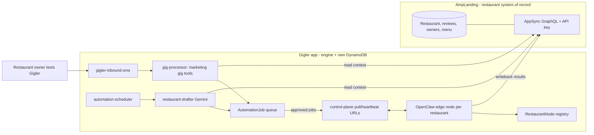

# Restaurant Automation Engine — homed in the Gigler repo

## Decision (locked)
- **Home:** the engine lives in the **Gigler** repo (this repo), a fully self-contained Amplify Gen2 app (own `auth`/`data`/`storage` + 8 Lambdas in [`amplify/backend.ts`](../amplify/backend.ts)). Gigler does NOT share AmpLanding's backend.
- **Keep the two apps separate.** Both are in the **same AWS account, us-east-2**.
- **Data boundary:** AmpLanding stays the **system of record for restaurant business data** (restaurants, reviews, domains, owner contacts, menu). Gigler owns the **automation/operational data** in its own tables.
- **Cross-app access:** Gigler talks to AmpLanding over **AppSync GraphQL + API key** (the `GEN1_APPSYNC_ENDPOINT` / `GEN1_API_KEY` already used by AmpLanding's `gbpManager`), mirroring Gigler's existing [`src/lib/appsync.ts`](../src/lib/appsync.ts). No direct cross-account DynamoDB.
- **Front door = Gigler itself.** Restaurant owners become **Gigler users**: they text Gigler ("post today's special", "reply to my new reviews") via a new `marketing` gig type whose tools drive the engine below. The dashboard approval path remains as an alternative. The heavy engine is shared; the gig type is just the friendly front door.

## Why Gigler is a good host (reuse, don't rebuild)
Gigler already ships the infra the engine needs:
- `gigler-reminder-scheduler` (EventBridge cadence) -> daily job trigger pattern.
- Gemini wiring + `gigler-deliverable-generator` + `gigler-media-processor` -> draft posts/replies, generate images/menus.
- Twilio + SES (`gigler-inbound-sms`, `gigler-email-handler`) -> owner comms/alerts.
- Lambda Function URL pattern -> control-plane endpoints for edge nodes.
- Gig types + `custom` escape hatch -> the owner-facing `marketing` front door.

## Architecture

## Work plan

### Phase 0 — Cross-app contract
- In **AmpLanding**, confirm/extend AppSync queries the drafter needs: restaurants with portal handles + status, recent reviews, owner contacts, `menuData`. Add a `MarketingActivity` model + mutation for writeback if missing.
- In **Gigler**, add `src/lib/amplanding-appsync.ts` (clone of [`src/lib/appsync.ts`](../src/lib/appsync.ts)) pointed at AmpLanding's endpoint via `AMPLANDING_APPSYNC_URL` / `AMPLANDING_APPSYNC_API_KEY` env vars.

### Phase 1 — Gigler-side data + drafter
- Add operational models to Gigler [`amplify/data/resource.ts`](../amplify/data/resource.ts): `RestaurantNode` (nodeId, restaurantId, status, lastHeartbeatAt, loginHealth) and `AutomationJob` (restaurantId, platform, kind=post|reply, payload, status Draft->Approved->Posting->Posted/Failed, liveUrl).
- Add `restaurant-drafter` Lambda: reads AmpLanding context via the new client, Gemini drafts daily posts + review replies, writes `AutomationJob` rows (status Draft).
- Add `restaurant-automation-scheduler` (or extend reminder-scheduler) to trigger drafting on a daily cadence.

### Phase 2 — Approval + control plane
- Approval surface (Gigler dashboard view, or Google Sheet bridge) flips jobs Draft -> Approved; optional auto-approve rules (e.g. 5-star replies).
- Control-plane Lambda Function URLs (same pattern as existing webhooks): `job-pull` (Approved jobs for a node) + `heartbeat` (node health, login status). Edge nodes authenticate with a registration token.

### Phase 3 — OpenClaw edge nodes (unchanged design, repointed)
- Notarized macOS `.pkg` (Mac primary) / Linux fallback image; Mosyle fleet mgmt; first-boot owner login wizard (per-restaurant logged-in GBP/FB/Apple/Yelp/TripAdvisor sessions, no master account).
- Node pulls Approved jobs from Gigler control plane, executes in the owner's logged-in browser, writes status + live URL back to `AutomationJob`, and posts `MarketingActivity` to AmpLanding.

### Phase 4 — Transparency + trust
- Surface posts/replies in the owner-facing transparency view (AmpLanding dashboard reads `MarketingActivity`).
- Gradual trust escalation; per-node login-health alerts + low-friction re-auth loop.

### Phase 5 — Restaurant front door (owners use Gigler directly)
Turn restaurant owners into Gigler users so the whole engine is drivable by text. Add a `marketing` gig type that wraps the engine:
- **Gig type wiring** (the standard extension points): `Gig.type` enum in [`amplify/data/resource.ts`](../amplify/data/resource.ts); the `GigType` unions in `src/lib/types.ts` and `amplify/functions/gigler-inbound-sms/utils.ts`; `GIG_TYPE_PROMPTS` in `amplify/functions/gigler-gig-processor/prompts.ts`; classifier (`PRESET_GIG_TYPES` + `classifyGigTypeFallback` in `gigler-inbound-sms`); reminder cadence in `gigler-reminder-scheduler/cadence.ts`; dashboard icon in `src/app/dashboard/page.tsx`.
- **Tools** in `gigler-gig-processor` that enqueue/approve `AutomationJob` rows: `draft_post`, `draft_review_reply`, `approve_job`, `list_pending` (declarations in `prompts.ts`, executors in `execute-actions.ts`).
- **Onboarding/link:** map a Gigler user + `marketing` gig to an AmpLanding `restaurantId` and its `RestaurantNode`, so owner phone -> restaurant context flows through to the engine.
- Owner UX example: text "post our Friday fish fry" -> drafter creates a Draft job -> owner replies "approve" -> edge node publishes -> Gigler texts back the live URL.

## Open questions / spikes
- Confirm AmpLanding's AppSync exposes (or can cheaply add) the exact restaurant/reviews/menu queries and a `MarketingActivity` writeback mutation.
- Decide approval UI: build into Gigler's Next.js dashboard vs. keep the Google Sheet from the prior plan vs. text-only approval via the `marketing` gig.
- Mosyle free tier / PPPC / supervision; Apple notarization under the FoodDiscovery developer account; ABM/DUNS reuse.
- Whether weekly metric snapshots live in AmpLanding (restaurant data) or Gigler (operational) — leaning AmpLanding.
- Onboarding: how an owner's Gigler phone number is authoritatively linked to a single AmpLanding restaurant (and what happens for multi-location owners).
